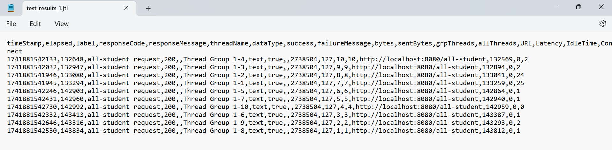
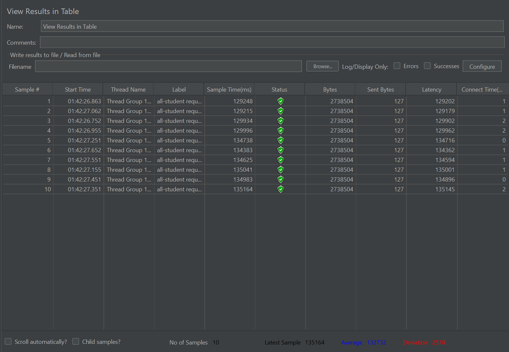
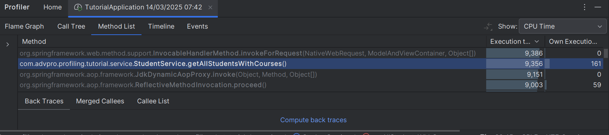
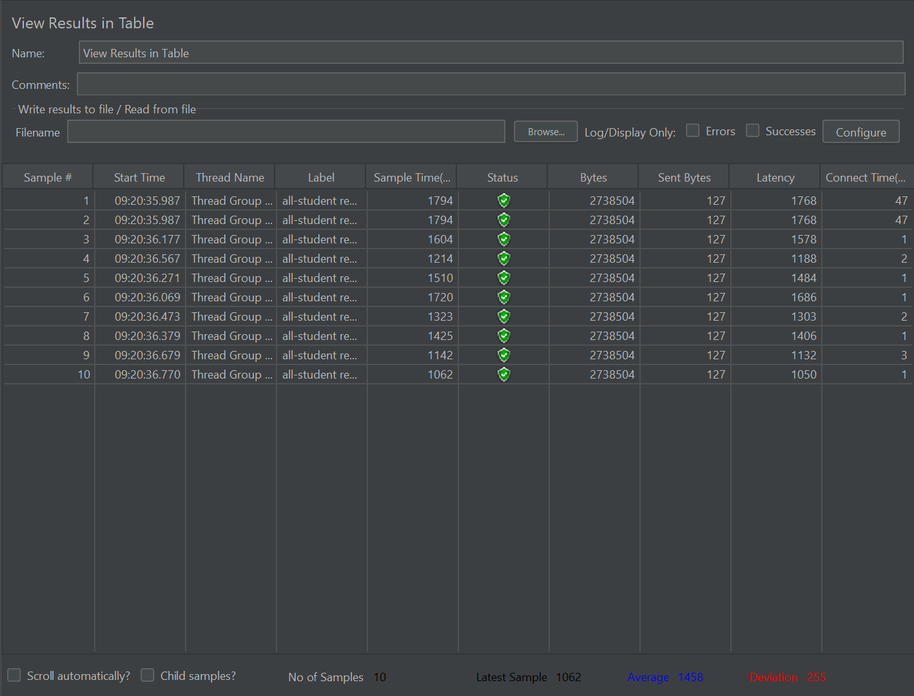
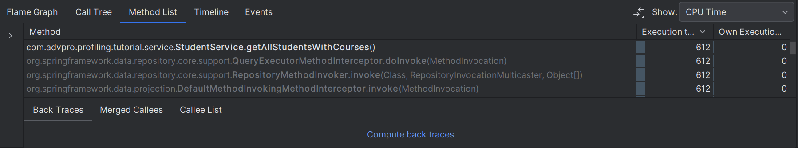

# Tutorial Pemrograman Lanjut
## Nayla Farah Nida - 2306213426

### Module 5
<details>
  <summary>Endpoint /all-studen</summary>
  
  Before optimizing:
  
  
  
    
  After optimizing:
  
  
    
  **CPU TIME**
  Before : ```9356 ms```
  After  : ```612 ms```
  Improvement :  **93.46%**
    
</details>
