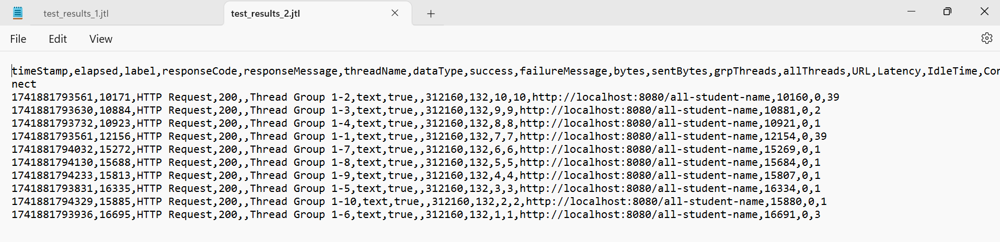
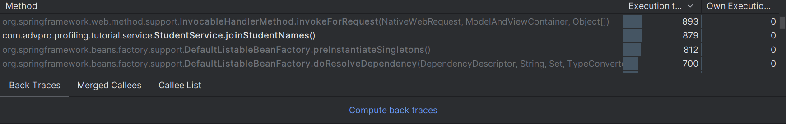
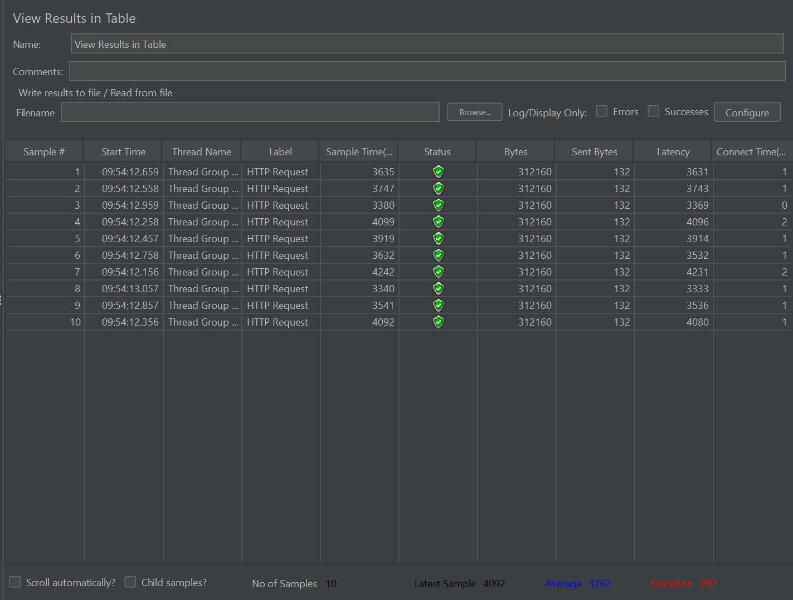
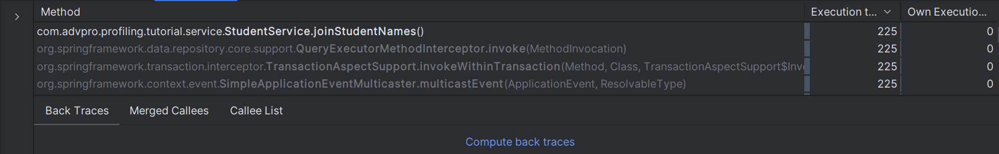
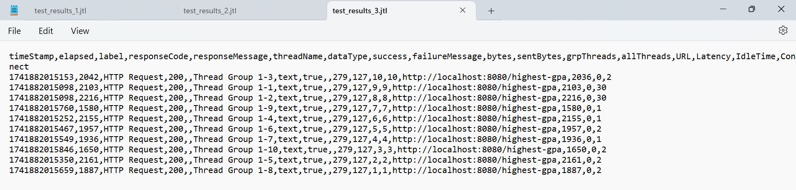
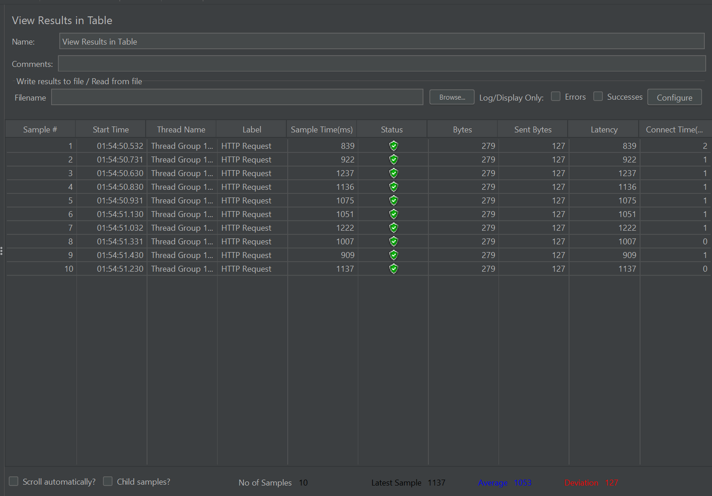
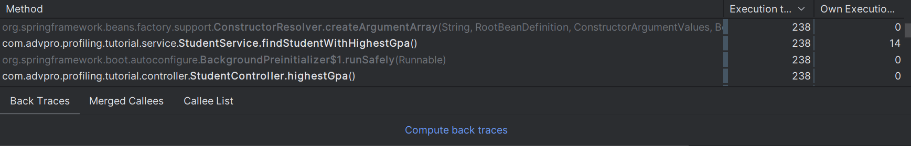
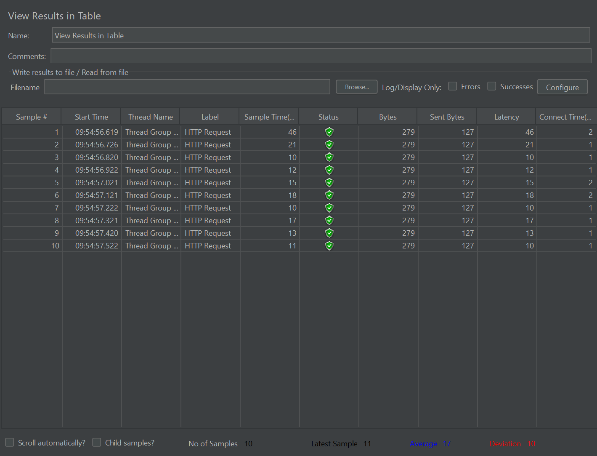
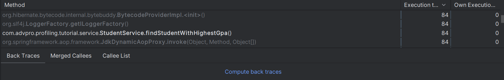

# Tutorial Pemrograman Lanjut
## Nayla Farah Nida - 2306213426

### Module 5
<details>
  <summary>Endpoint /all-student</summary>
  
  Before optimizing:
  
  
  
    
  After optimizing:
  
  
  
    
  **CPU TIME**
  
  Before : ```9356 ms```
  
  After  : ```612 ms```
  
  Improvement :  **93.46%**
    
</details>

<details>
  <summary>Endpoint /all-student-name</summary>
  
  Before optimizing:
  
  
  
    
  After optimizing:
  
  
  
    
  **CPU TIME**
  
  Before : ```879 ms```
  
  After  : ```225 ms```
  
  Improvement :  **74.40%**
    
</details>

<details>
  <summary>Endpoint /highest-gpa</summary>
  
  Before optimizing:
  
  
  
    
  After optimizing:
  
  
  
    
  **CPU TIME**
  
  Before : ```238 ms```
  
  After  : ```84 ms```
  
  Improvement :  **64.71%**
    
</details>
